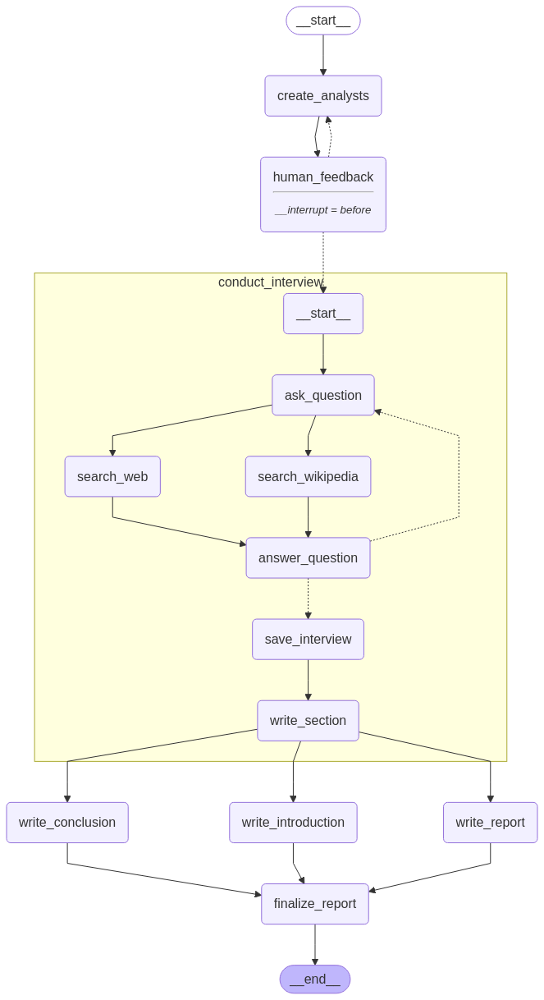

# Multi-Agent Research Assistant

A lightweight, modular multi-agent research assistant powered by LLMs. This system simulates a team of AI analysts conducting structured research on a given topic using selected source documents. It supports human-in-the-loop planning, dynamic sub-topic generation, expert interviews, and customizable report generation.

---

## 🔍 Overview

This system is designed to automate and enhance the research process. Users provide a topic and research materials, and the assistant orchestrates multiple LLM agents to extract, structure, and synthesize insights into a final report.

---

## ⚡ Features

* **Custom Source Selection**: Upload or link any research documents for AI processing.
* **Automatic Sub-topic Planning**: The system breaks down broad research topics into manageable sub-topics.
* **Human-in-the-Loop Planning**: Users can review and refine sub-topics before analysis begins.
* **Multi-Agent Architecture**: Each AI analyst handles one sub-topic independently.
* **Expert AI Interviews**: Analysts simulate interviews with expert AIs to extract deep insights.
* **Graph-Based Reasoning**: Interview dialogues are saved as sub-graphs capturing internal reasoning.
* **Parallel Research Execution**: Map-reduce style parallelism allows efficient information gathering.
* **Customizable Report Generation**: Prompt-driven synthesis creates flexible, user-defined report formats.

---

## 📆 Example Use Case

### Topic: *"Machine Learning Applications for Farmers"*

1. **Input**: Topic + uploaded research documents.
2. **Planning**:

   * AI suggests sub-topics: crop yield prediction, pest detection, smart irrigation.
   * Human user reviews/edits these sub-topics.
3. **Research**:

   * Each AI agent interviews a virtual expert about their assigned sub-topic.
   * These interviews follow a multi-turn Q\&A format.
4. **Graph Capture**:

   * Each interview is stored in a sub-graph showing questions, answers, and reasoning.
5. **Report**:

   * All insights are synthesized into a final structured report.
   * Format is user-defined via prompt templates.

---

## ⚙️ Architecture Summary

```text
User Input (Topic + Sources)
        ⬇
Planning Agent (Sub-topic Splitter)
        ⬇
Human-in-the-Loop Validation
        ⬇
AI Analyst Agents (One per Sub-topic)
        ⬇
Expert AI Interviews (Multi-turn Dialogue)
        ⬇
Knowledge Sub-Graphs (Captured States)
        ⬇
Map-Reduce Style Execution
        ⬇
Report Synthesizer (Prompt-Driven Output)
```



---

## 🚀 Getting Started

### Prerequisites:

* Python 3.9+
* Jupyter Notebook
* LangChain
* OpenAI / Groq LLM access

### Installation

```bash
pip install -r requirements.txt
```

### Run

Open the notebook and follow the step-by-step cells to:

* Input your research topic
* Upload documents
* Trigger planning and validation
* Launch the analyst agents
* View the final report

---

## 🎓 References

* [STORM Paper](https://arxiv.org/abs/2402.01763) - structured interviewing approach
* [LangChain](https://www.langchain.com/) - for LLM orchestration
* [Map-Reduce Pattern](https://en.wikipedia.org/wiki/MapReduce) - for parallel processing inspiration

---

## 📊 Future Work

* Support for live web search as a source
* UI-based sub-topic approval
* Integration with vector stores for document retrieval
* More detailed knowledge graph visualizations

---

## 🙏 Contributions

Pull requests and suggestions are welcome!

---

## ✉ Contact

For feedback or questions, please contact [Md Al Amin](https://www.linkedin.com/in/mdalamin5/) or open an issue.


---

> Empowering research through structured, intelligent, and modular AI agents.
