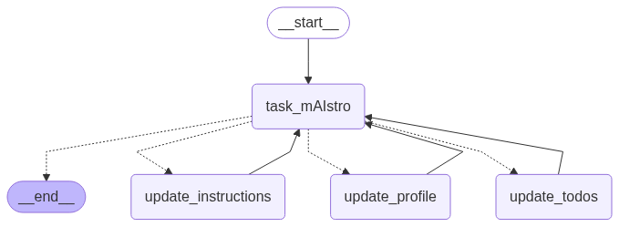

# Memory Agent Streamlit App - README

## Overview
This is a Streamlit application that converts the Memory Agent notebook into an interactive web application. The app allows users to manage ToDo lists with the help of an AI assistant that has long-term memory capabilities.

## Features
- Multiple chat sessions with AI assistant
- Automatic extraction of ToDo items from conversations
- Long-term memory that persists across chat sessions
- User preference customization
- Professional UI with responsive design

## Requirements
- Python 3.8+
- Streamlit
- LangChain
- Trustcall
- Groq API key

## Installation

1. Clone or download this repository
2. Install the required dependencies:
```bash
pip install streamlit langchain-groq trustcall python-dotenv langgraph langchain-core
```
3. Set up your environment variables:
   - Copy the `.env.example` file to `.env`
   - Add your Groq API key to the `.env` file

## Running the App

Run the app with the following command:
```bash
streamlit run app.py
```

The app will be available at http://localhost:8501 in your web browser.

## Deployment

To deploy this app to Streamlit Cloud:

1. Create a GitHub repository and push the code
2. Sign up for Streamlit Cloud (https://streamlit.io/cloud)
3. Connect your GitHub repository
4. Add your API keys as secrets in the Streamlit Cloud dashboard
5. Deploy the app

## App Structure



- `app.py`: Main application file
- `.env.example`: Example environment variables file

## Usage

1. Click "New Chat" to start a conversation
2. Chat with the AI assistant about your tasks and plans
3. ToDo items will be automatically extracted and displayed in the sidebar
4. Important information will be saved as memories for future reference
5. Customize your preferences in the sidebar

## Customization

You can customize the app by:
- Modifying the CSS styles in the `st.markdown` section
- Adjusting the user preferences in the sidebar
- Changing the model used by updating the `initialize_llm` function

## Troubleshooting

If you encounter issues:
- Ensure your API keys are correctly set in the `.env` file
- Check that all dependencies are installed
- Verify you have an active internet connection for API calls
