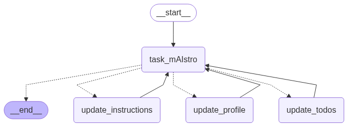

# MemorySync-AI Chatbot - Agent based Long term memory Management

## Overview
Developed an AI chatbot with cross-thread memory for personalized user interactions and to-do list management.

•Built a context-aware chatbot with voice interaction. Used LangGraph to orchestrate agents for user profile and task updates. Enhanced user engagement with intuitive voice input/output.
•Implemented cross-thread memory for long-term personalization. Leveraged InMemoryStore to retain user data across sessions. Improved response relevance with persistent context.
•Enabled dynamic ToDo list updates. Applied trustcall extractors to manage tasks via multi-agent workflows. Streamlined task tracking for users.

## Features
- Multiple chat sessions with AI assistant
- Automatic extraction of ToDo items from conversations
- Long-term memory that persists across chat sessions
- User preference customization
- Professional UI with responsive design

## Requirements
- Python 3.8+
- Streamlit
- LangChain
- Langgraph
- Trustcall
- Groq API key

## Installation

1. Clone or download this repository
2. Install the required dependencies:
```bash
pip install streamlit langchain-groq trustcall python-dotenv langgraph langchain-core
```
3. Set up your environment variables:
   - Copy the `.env.example` file to `.env`
   - Add your Groq API key to the `.env` file

## Running the App

Run the app with the following command:
```bash
streamlit run app.py
```

## App Structure



- `app.py`: Main application file
- `.env.example`: Example environment variables file

## Usage

1. Click "New Chat" to start a conversation
2. Chat with the AI assistant about your tasks and plans
3. ToDo items will be automatically extracted and displayed in the sidebar
4. Important information will be saved as memories for future reference
5. Customize your preferences in the sidebar

## Customization

You can customize the app by:
- Modifying the CSS styles in the `st.markdown` section
- Adjusting the user preferences in the sidebar
- Changing the model used by updating the `initialize_llm` function

## Troubleshooting

If you encounter issues:
- Ensure your API keys are correctly set in the `.env` file
- Check that all dependencies are installed
- Verify you have an active internet connection for API calls
