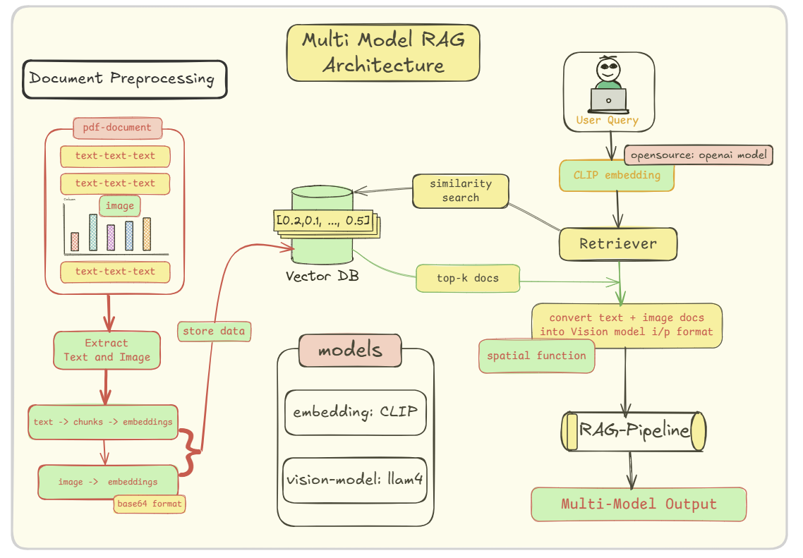

# Multi-Model RAG with CLIP and Llama

This project implements an advanced Retrieval-Augmented Generation (RAG) pipeline capable of processing and understanding both text and images within PDF documents. By leveraging the power of OpenAI's CLIP for unified embeddings and a vision-capable LLM like Llama for generation, this system can answer complex queries that require contextual understanding of text and visuals combined.

## Architecture

The entire workflow, from document ingestion to generating a multimodal answer, is captured in the architecture diagram below.




## Key Features

* **Multimodal Document Processing**: Extracts and processes both text and images from PDF files using PyMuPDF.
* **Unified Embedding Space**: Utilizes OpenAI's CLIP model to generate embeddings for text chunks and images, placing them in a shared semantic space.
* **Efficient Retrieval**: Employs a FAISS vector store for fast and accurate similarity searches across both text and image embeddings.
* **Context-Aware Generation**: Formats the retrieved text and images into a single, rich prompt for a vision-capable Large Language Model (in this case, Llama via the Groq API).
* **End-to-End Pipeline**: A complete, runnable pipeline from a raw PDF and a user query to a final, synthesized answer.

## Technology Stack

* **Core Framework**: LangChain
* **LLM & API**: Llama (via Groq), `langchain-groq`
* **Embedding Model**: `openai/clip-vit-base-patch32` from Hugging Face `transformers`
* **Vector Store**: FAISS (Facebook AI Similarity Search)
* **PDF Processing**: PyMuPDF (`fitz`)
* **Core Libraries**: PyTorch, NumPy, Pillow (PIL)
* **Environment**: Jupyter Notebook, Python 3.11+

## Setup and Installation

### 1. Clone the Repository

```bash
git clone https://github.com/MDalamin5/Agentic-Ai-Journey-with-HuggingFace-and-LangChain-Academy-Course.git
cd Agentic-Ai-Journey-with-HuggingFace-and-LangChain-Academy-Course
cd LangGraph-Krishacademy
cd Module-15.5-Multimodel-Agentic-RAG
```

### 2. Create a Python Virtual Environment

```bash
# For Windows
python -m venv venv
.\venv\Scripts\activate

# For macOS/Linux
python3 -m venv venv
source venv/bin/activate
```

### 3. Install Dependencies

Install the requirements:

```bash
pip install -r requirements.txt
```

### 4. Set Up Environment Variables

Create a file named `.env` in the root directory:

```text
GROQ_API_KEY="your_groq_api_key_here"
HF_TOKEN="your_huggingface_token_here"
OPENAI_MODEL="llama3-70b-8192"  # Or any model available on Groq
LLAMA_MODEL="llama3-70b-8192"   # Or any model available on Groq
```

## How It Works: The Pipeline Explained

### 1. Document Ingestion and Parsing

* Load a PDF (`multimodal_sample.pdf`).
* Iterate through each page using PyMuPDF (`fitz`) to extract raw text and image data.

### 2. Text and Image Processing

* **Text**: Chunked using `RecursiveCharacterTextSplitter` and treated as separate documents.
* **Images**: Extracted as byte data, converted to Pillow objects, and stored as base64 strings (required for final prompts).

### 3. Unified Embedding with CLIP

* Uses `openai/clip-vit-base-patch32` for embedding.
* `embed_text()` and `embed_image()` convert text chunks and images into 512-dimensional vectors.
* Ensures semantically similar text and images have close vector representations.

### 4. Vector Storage

* Embeddings are stored in FAISS along with metadata (page number, type, image ID).

### 5. Retrieval

* User query is embedded with the CLIP text encoder.
* A similarity search in FAISS retrieves top-k relevant documents.
* Documents include text chunks and image placeholders.

### 6. Multimodal Prompting and Generation

* `create_multimodal_message` function formats the prompt for the vision-capable LLM.
* Prompt includes the original query, retrieved texts, and images (as base64 URLs).
* Sent to Llama via Groq API to generate an answer combining visual and textual context.

## Usage

1. Place your PDF inside the `documents/` folder.
2. Open `experiments-notebook.ipynb` in Jupyter Lab.
3. In cell \[8], update `pdf_path`:

```python
pdf_path = "documents/your_document_name.pdf"
```

4. Run all cells sequentially. Final cell (\[30]) demonstrates full usage of the `multimodal_pdf_rag_pipeline` with example queries.

## Example Output

```text
Query: Summarize the main findings from the document
--------------------------------------------------
Retrieved 2 documents:
  - Text from page 0: Annual Revenue Overview
This document summarizes the revenue trends across Q1, Q2, and Q3. As illust...
  - Image from page 0

Answer: The main findings from the document are:

* Revenue grew steadily across Q1, Q2, and Q3.
* The highest growth was recorded in Q3.
* Key factors contributing to growth:
  + Q1: Introduction of new product lines.
  + Q2: Successful marketing campaigns.
  + Q3: Global expansion.
```

## Acknowledgements

A special thanks to **Krish Naik** for his excellent tutorials and content, which served as a great inspiration and guide for this project.
